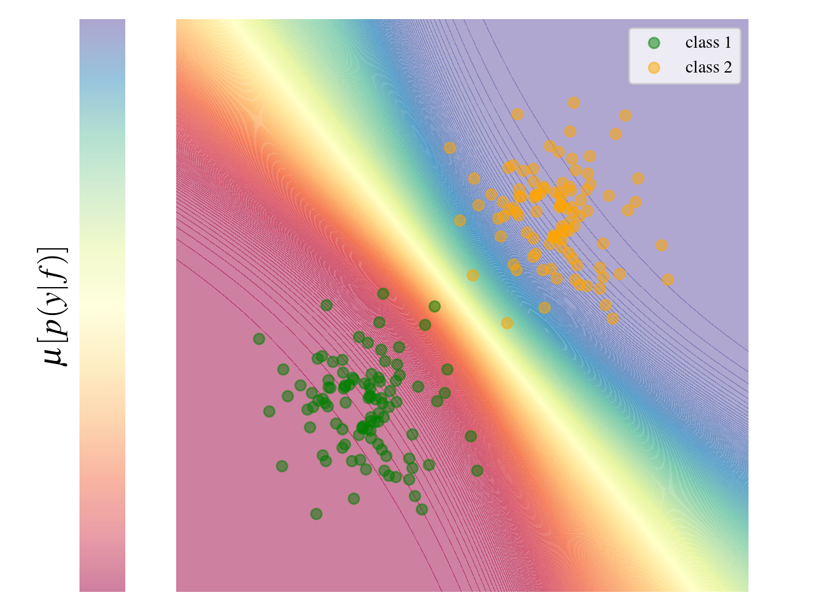
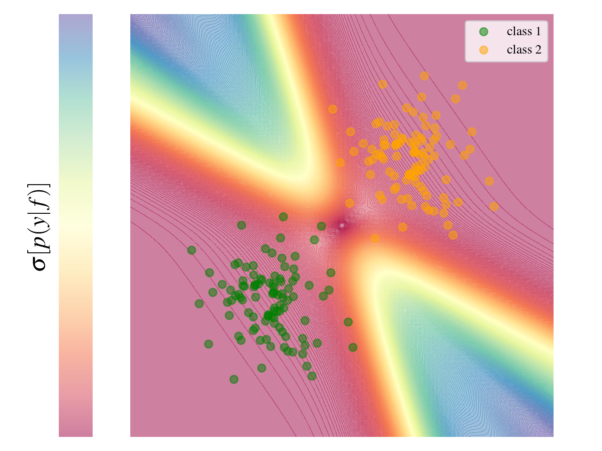
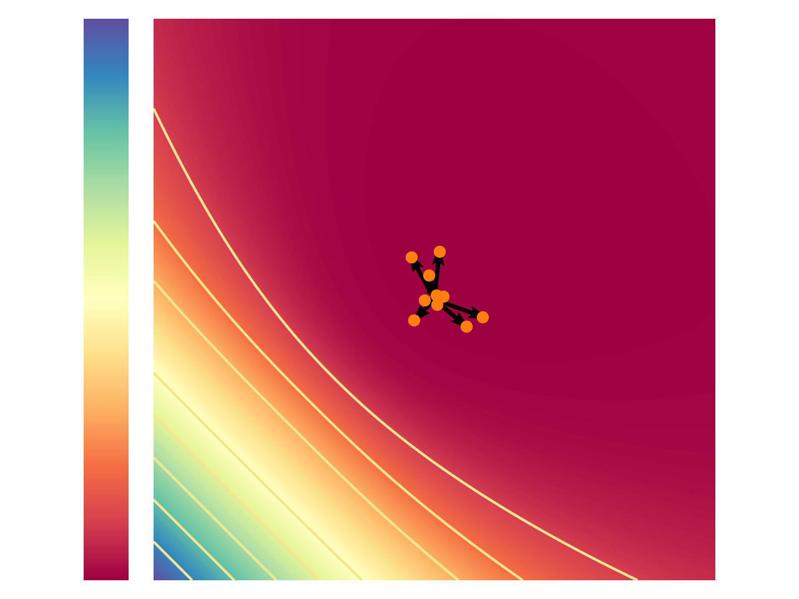
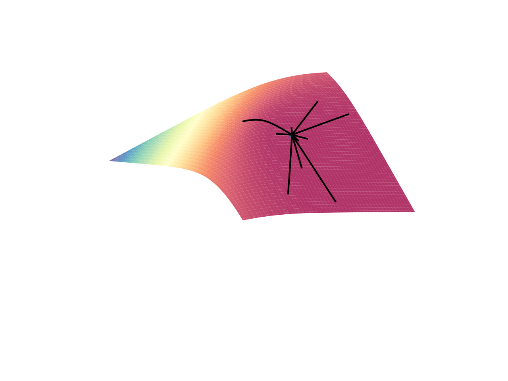

# Geometric Bayesian
This repository contains JAX-based implementations for posterior approximation and sampling in parameter spaces with non-Euclidean geometry, within the context of Bayesian inference.
The (linear) operator-based structure is heavily inspired by [`gpytorch`](https://github.com/cornellius-gp/gpytorch) and therefore by [`linear_operator`](https://github.com/cornellius-gp/linear_operator).
The geometric structure, in particular the embedding-based first (metric) and second (Christoffel symbols) order geometry, is a more efficient, matrix-free, jax implementation of [`learn-embedding`](https://github.com/nash169/learn-embedding) algorithms.

<p align="center">
  
  
</p>

<p align="center">
  
  
</p>

## Features/ToDo
### Operators
The library provides matrix-free efficient implementation of some of the most common operators.
 - [x] Dense Operator
 - [x] Symmetric Operator
 - [x] Positive Semi Definite Operator
 - [x] Low Rank Operator
 - [x] Diagonal Operator
 - [ ] Sparse operator (see [`manifold-gp`](https://github.com/nash169/manifold-gp))

### Probability Density Functions
For Bayesian regression and classification, the library offer a set operator-based densities for efficiently construct common quantities like likelihood, prior, ...
 - [x] Bernoulli
 - [x] Categorical
 - [x] Normal
 - [x] Multivariate Normal
 - [ ] others...

### Models
 - [x] MLP
 - [ ] others...

### Integrators
For dynamical systems integration on manifolds, the library provide a set of basic integration methods.
Integration is implemented via the *jit* friendly `jax.lax.scan`.  
It first and second order dynamical systems as well parallel trajectories integration.
 - [x] Forward-Euler
 - [x] Runge-Kutta (2,3)
 - [x] Runge-Kutta (4,5)
 - [ ] Implicit methods...

## Installation
In order to install the package in `.local` run
```sh
pip(pip3) install .
```
For local installation in the current directory
```sh
pip(pip3) install -e .
```
It also supports `uv`
```sh
uv sync && source .venv/bin/activate
```

#### Some useful link:
 - https://flax.readthedocs.io/en/latest/nnx_basics.html#scan-over-layers
 - https://flax.readthedocs.io/en/latest/guides/linen_to_nnx.html
 - https://docs.jax.dev/en/latest/jit-compilation.html
 - https://docs.jax.dev/en/latest/pytrees.html
 - https://docs.jax.dev/en/latest/advanced-autodiff.html#advanced-autodiff
 - https://docs.jax.dev/en/latest/notebooks/Custom_derivative_rules_for_Python_code.html#
